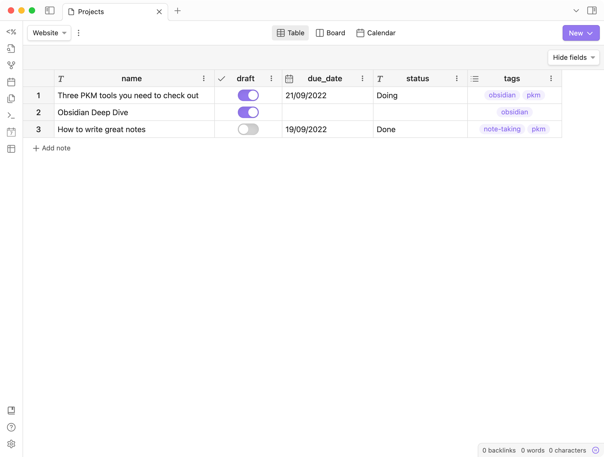
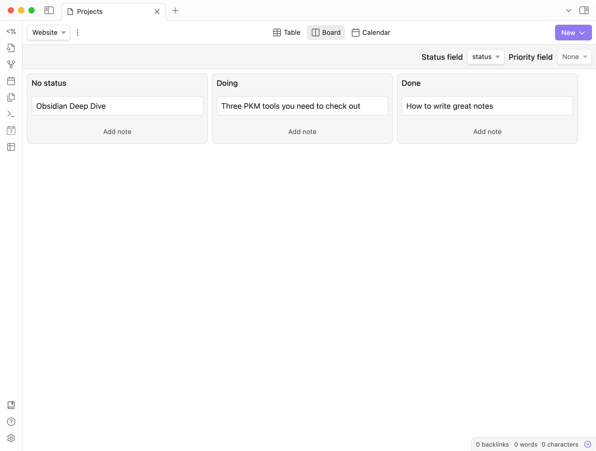
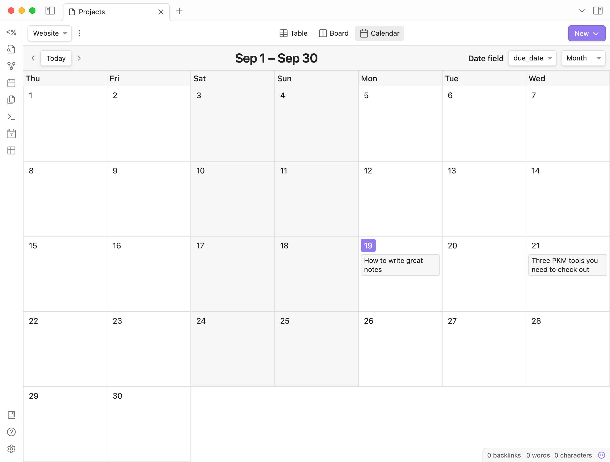

# Obsidian Projects

Obsidian Projects is a plugin for [Obsidian](https://obsidian.md) that lets you manage and visualize notes for project management.

- Create folder-based projects
- Switch between three different views: Table, Board, and Calendar.
- Configure note templates for each project.

For example, if you're a content manager, Project can help you manage your content calendar. Create drafts, keep track of their status, and when they are scheduled to be published.

Projects uses front matter as the source of data. You can edit front matter directly from each view.

> **Currently in beta:** This plugin is not yet published. To beta test it, you can use [BRAT](https://github.com/TfTHacker/obsidian42-brat).

## Views

Obsidian Projects supports three types of views: _Table_, _Board_, and _Calendar_.

### Table

### Board

### Calendar

